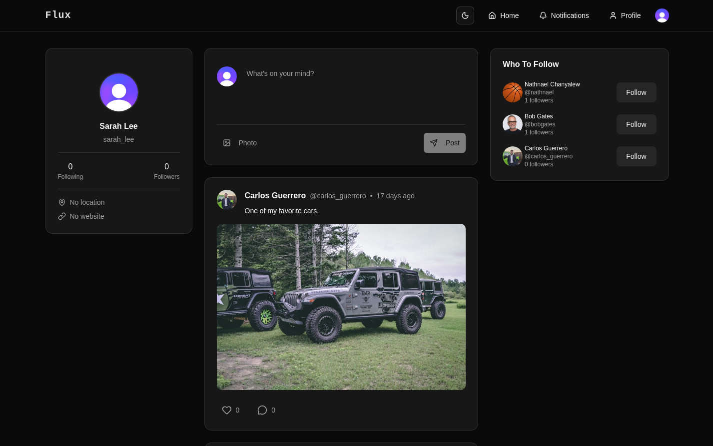

# Flux

Flux is a full-stack social media application that allows users to create posts, like content, and follow other users.

## 🚀 Live Demo

🔗 https://flux-delta-two.vercel.app/

## ✨ Features

- Secure user authentication and authorization with Clerk
- Create and delete posts
- Add comments to posts
- Like and unlike posts
- Follow and unfollow other users
- Upload images to posts with UploadThing
- Receive notifications for new likes, comments, and followers
- Instant toast notifications for user actions
- Discover new users through suggestions
- View and update your profile
- Browse other users' profiles, including their posts and liked content
- Protected routes for authenticated users
- Dark and light mode support
- Fully responsive design for desktop and mobile devices

## 🛠️ Tech Stack

### Frontend

- React
- Next.js
- TypeScript
- Tailwind CSS
- shadcn/ui

### Backend

- Clerk (Authentication)
- Neon (Serverless PostgreSQL)
- Prisma ORM
- UploadThing

### Deployment

- Vercel

## 📸 Homepage



## 📦 Installation

Clone the repository:

```bash
git clone git@github.com:nchanyal/flux.git
cd flux
```

Install dependencies:

```bash
npm install
```

Create a `.env` file and add the required environment variables:

```env
NEXT_PUBLIC_CLERK_PUBLISHABLE_KEY=
CLERK_SECRET_KEY=
DATABASE_URL=
UPLOADTHING_TOKEN=
```

Run the development server:

```bash
npm run dev
```
